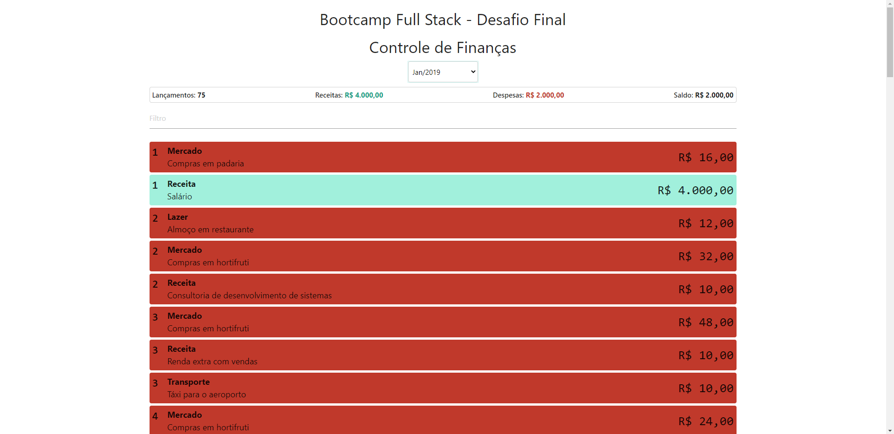

<h1 align="center">
     <a href="https://app-cfp-desafio-final.herokuapp.com" alt="controle-financas"> Controle de Finanças Pessoal </a>
</h1>

Projeto sugerido pelo [Bootcamp](https://www.igti.com.br/custom/bootcamp-desenvolvedor-full-stack) Full Stack do [IGTI](https://www.igti.com.br/), que consiste em desenvolver um controle de finanças pessoal.

---

## Demonstração da aplicação

<p align="center" style="display: flex; align-items: flex-start; justify-content: center;">
  
</p>

---

### Pré-requisitos

Antes de começar, você vai precisar ter instalado em sua máquina as seguintes ferramentas:
[Git](https://git-scm.com), [Node.js](https://nodejs.org/en/) e [Yarn](https://yarnpkg.com/). Além disso,
será preciso ter uma conta no [MongoDB](https://www.mongodb.com/) para ter seu próprio banco de dados.

---

### Rodando a aplicação

```

# Clone este repositório
$ git clone https://github.com/lucasfe4nor/app-cfp-bootcampigti.git

# Acesse a pasta do projeto no terminal/cmd para ter acesso a raiz da pasta
$ cd app-cfp-bootcampigti

# Instale as dependências
$ yarn

# Crie um arquivo .env na raiz seguindo as especificações do arquivo .env.sample
# que consiste em colocar suas credenciais do banco de dados

# Execute a aplicação em modo desenvolvimento
$ yarn server

# O servidor iniciará na porta:3001 - acesse http://localhost:3001

# Acesse a pasta do frontend
$ cd client

# Instale as dependências
$ yarn

# Execute a aplicação
$ yarn start

# A aplicação será aberta na porta:3000 - acesse http://localhost:3000


```

---

## Tecnologias

- **[React](https://reactjs.org/)**
- **[Materialize](https://materializecss.com/)**
- **[NodeJS](https://nodejs.org/en/)**
- **[Express](https://expressjs.com/)**
- **[CORS](https://expressjs.com/en/resources/middleware/cors.html)**
- **[dotenv](https://github.com/motdotla/dotenv#readme)**
- **[Mongoose](https://mongoosejs.com/)**

---

## Status

- Concluído ✔️✔️✔️

---

## 👨‍💻 Autor

- **Lucas Sampaio (lucasfe4nor)** - [Twitter](https://twitter.com/lucasfe4nor) - [LinkedIn](https://www.linkedin.com/in/lucasgbsampaio/)

---

## 📝 Licença

Este projeto está sob a licença [MIT](./LICENSE).
